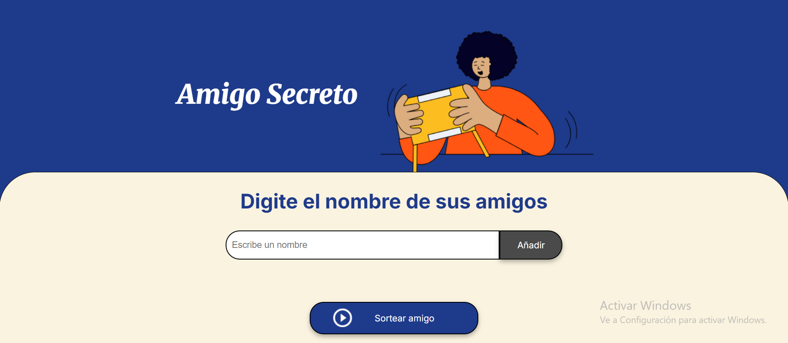

# 🙍‍♂️ Amigo Secreto - Challenge



## 📝 Descripción
Este proyecto es un desafío de "Amigo Secreto" desarrollado en HTML, CSS y JavaScript. Permite agregar nombres de amigos, listarlos y realizar un sorteo aleatorio para seleccionar a un amigo secreto.

## 🏁 Estado de proyecto
Este proyecto ha sido completado exitosamente. Todas las funcionalidadews han sido implementadas y probadas. No se planean futuras actualizaciones o cambios importantes.
El código se encuentra en su versión final y está disponible para su uso o referencia


## 🛠️ Tecnologías utilizadas
- HTML5
- CSS3
- JavaScript (ES6)

## 🚀 Instalación
No es necesaria ninguna instalación especial para ejecutar este proyecto. Simplemente sigue estos pasos:

1. Clona el repositorio en tu computadora:
   ```bash
   git clone https://github.com/tu-usuario/challenge-amigo-secreto.git
   ```
2. Abre el archivo `index.html` en cualquier navegador web.

## ✔ Uso
1. Escribe el nombre de un amigo en el campo de entrada.
2. Presiona el botón "Agregar" para añadirlo a la lista.
3. Repite el proceso para agregar más amigos.
4. Cuando haya al menos dos amigos, presiona "Sortear" para elegir un amigo secreto aleatoriamente.

## 📌 Funcionalidades
- Conversión de nombres a mayúsculas para evitar duplicados.
- Validación de nombres vacíos o repetidos.
- Sorteo aleatorio con un solo clic.
- Reseteo de la lista luego del sorteo.

## 👨‍💻 Posibles problemas y soluciones
### 1. Los nombres no se agregan a la lista
   - Asegúrate de que el `input` tenga un ID correcto en `index.html`.
   - Revisa la consola del navegador (`F12` > Consola) por posibles errores de JavaScript.

### 2. El sorteo no funciona
   - Asegúrate de que haya al menos dos nombres en la lista antes de sortear.
   - Verifica que `sortearAmigo()` esté correctamente enlazada al botón en el HTML.

### 3. Los nombres se agregan repetidos
   - Verifica que la comparación en `agregarAmigo()` utilice `toUpperCase()` correctamente.

## 🤝 Contribución
Si deseas contribuir con mejoras o correcciones:
1. Haz un fork del repositorio.
2. Crea una nueva rama (`git checkout -b mejora-nueva`).
3. Realiza los cambios y haz commit (`git commit -m "Descripción de la mejora"`).
4. Envía un pull request.

## 📲 Contacto
Si tienes dudas o sugerencias, puedes comunicarte con el desarrollador del proyecto a través del curso.

